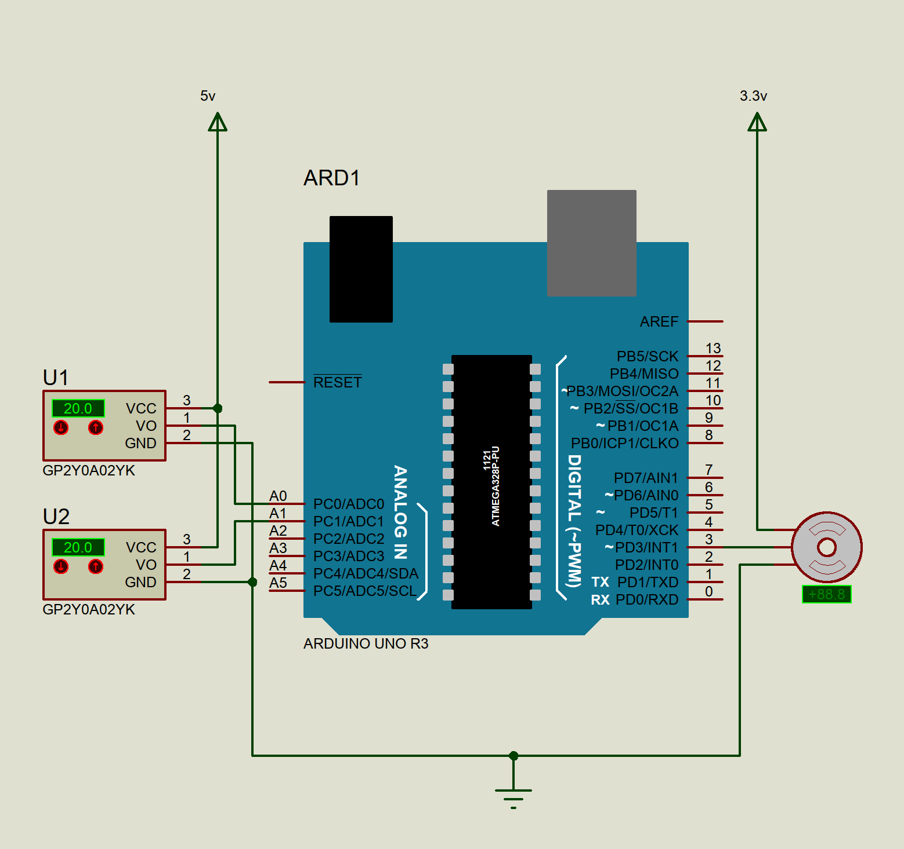
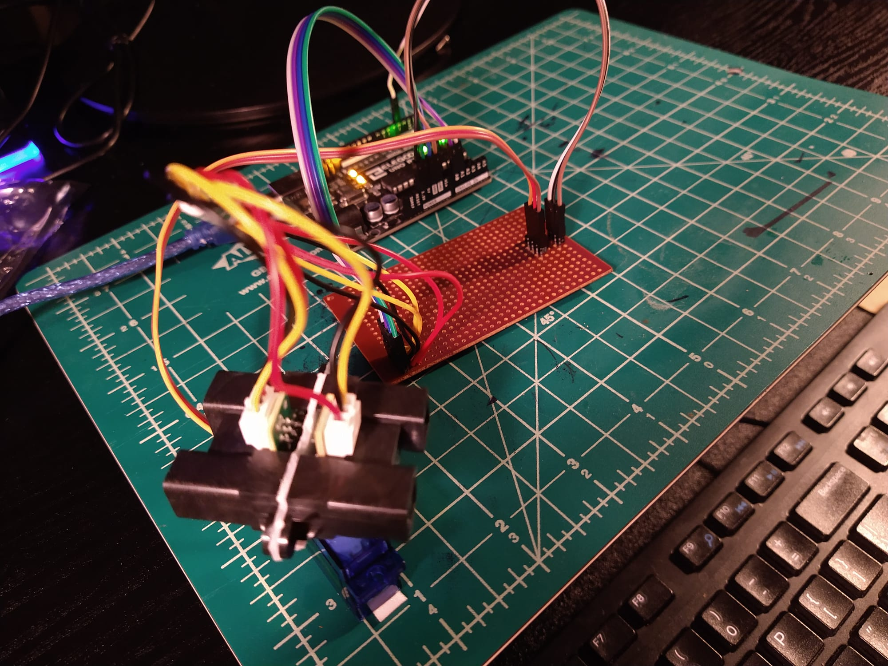
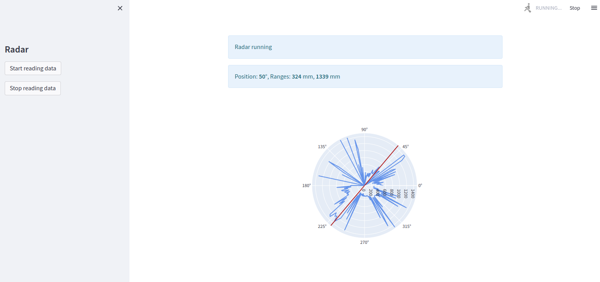

# Mini Radar in Arduino using Python
An inexpensive 360 degree mini radar with live dashboard using Arduino and Python

Based on [this online article](https://towardsdatascience.com/build-a-diy-mini-radar-using-arduino-python-and-streamlit-c333006681d7).

# Components
1. [Arduino Uno](https://store-usa.arduino.cc/collections/boards/products/arduino-uno-rev3)
2. [Micro Servo SG90](http://www.ee.ic.ac.uk/pcheung/teaching/DE1_EE/stores/sg90_datasheet.pdf)
3. [Distance Measuring Sensor Unit (GP2Y0A02YK0F)](https://www.sparkfun.com/datasheets/Sensors/Infrared/gp2y0a02yk_e.pdf)

# Schematic


# Installation and Running in Ubuntu 20.04
#### Install Arduino IDE
```
sudo apt install arduino
```

#### Install code
```
git clone https://github.com/arindam-bose/mini-radar-arduino
cd mini-radar-arduino
virtualenv venv -p /usr/bin/python3
source venv/bin/activate
pip install streamlit==1.10.0 pyserial==3.5 plotly==5.9.0
```

#### Program Arduino
1. Open Arduino IDE
2. Verify and Upload [servo_sensor.ino](servo_sensor/servo_sensor.ino)

#### Run Python
```
streamlit run main.py
```
 